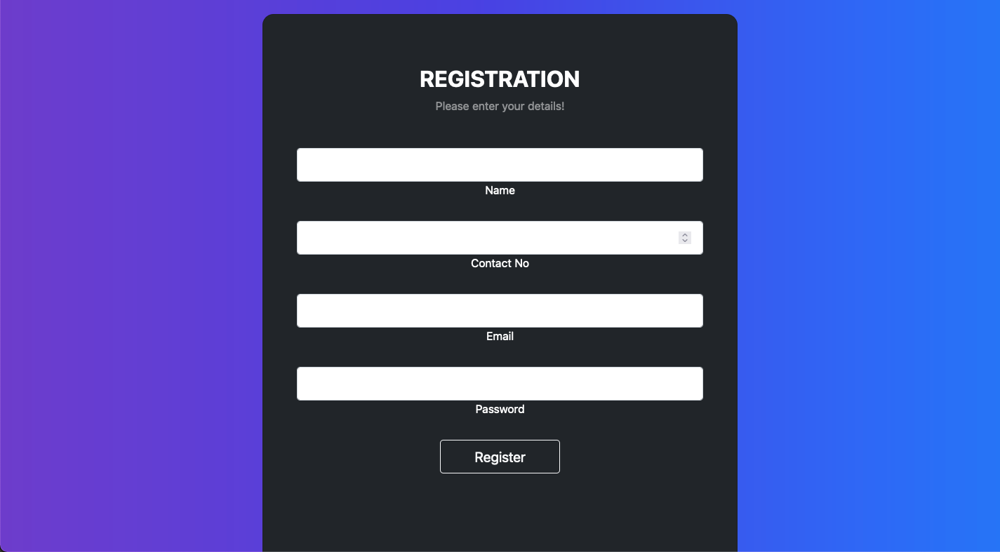

## Automated Hand Sanitizer and Mask Detector

An **AI-driven health & hygiene solution** that detects face masks using a CNN model and automates a **contactless hand sanitizing process** with Arduino-controlled hardware.
This system was built to combat **COVID-19** by ensuring **mask compliance** and **hand sanitization** before entry into public spaces.

---

### Problem Statement

During the COVID-19 pandemic, it became essential to enforce mask-wearing and hand sanitization in public spaces.
This project provides a **touch-free device** that:

1. **Detects a face mask** using a trained CNN model.
2. **Dispenses sanitizer** automatically using an Arduino-controlled pump when a person’s hand is detected.
3. Optionally checks **temperature** or verifies a **QR code certificate** (if extended).

---

### Objectives

* **Automate** the process of mask detection and hand sanitization.
* **Minimize human contact**, reducing infection spread.
* Provide **real-time monitoring** of sanitizer levels and device status via an **admin portal**.

---

### System Architecture

The system is a combination of **hardware** (Arduino, IR sensors, pump) and **software** (TensorFlow, OpenCV, Flask).

#### Hardware Components

| Component                 | Function                                                   |
| ------------------------- | ---------------------------------------------------------- |
| **Laptop / Raspberry Pi** | Runs the mask detection model and processing logic.        |
| **Arduino UNO**           | Controls the IR sensor and sanitizer pump.                 |
| **IR Sensor**             | Detects the presence of a hand under the sanitizer nozzle. |
| **Camera (Laptop/USB)**   | Captures live video for face and mask detection.           |
| **5V Pump**               | Dispenses sanitizer when triggered.                        |
| **Ultrasonic Sensor**     | Measures sanitizer quantity (optional).                    |

#### Software Components

| Technology           | Purpose                                   |
| -------------------- | ----------------------------------------- |
| **OpenCV**           | Face detection (Haarcascade classifier).  |
| **TensorFlow/Keras** | CNN model for mask detection.             |
| **PySerial**         | Communication between Arduino and Python. |
| **Flask**            | Backend server for the admin portal.      |
| **SQL Database**     | Stores device information and usage logs. |

---

### Workflow

1. **Face Detection**

   * The camera captures a live image.
   * OpenCV’s Haarcascade detects the face.
2. **Mask Detection**

   * The CNN model (trained using TensorFlow) checks if the person is wearing a mask.
3. **Sanitization**

   * If a mask is detected, a signal is sent via PySerial to Arduino.
   * Arduino activates the IR sensor and pump to dispense sanitizer.
4. **Admin Portal (Optional)**

   * Monitor sanitizer quantity, people count, and device status via a web dashboard.

---

### Deep Learning Model

* **Model Type**: Convolutional Neural Network (CNN)
* **Dataset**: Kaggle Face Mask Detection dataset

  * > 700 images of masked and unmasked faces
  * [Dataset Link](https://www.kaggle.com/andrewmvd/face-mask-detection)
* **Training**:

  ```python
  model = tf.keras.models.Sequential([
      tf.keras.layers.Conv2D(32, (3,3), activation='relu', input_shape=(50,50,3)),
      tf.keras.layers.MaxPooling2D(2,2),
      tf.keras.layers.Conv2D(64, (3,3), activation='relu'),
      tf.keras.layers.MaxPooling2D(2,2),
      tf.keras.layers.Conv2D(128, (3,3), activation='relu'),
      tf.keras.layers.MaxPooling2D(2,2),
      tf.keras.layers.Dropout(0.1),
      tf.keras.layers.Flatten(),
      tf.keras.layers.Dense(512, activation='relu'),
      tf.keras.layers.Dense(1, activation='sigmoid')
  ])
  model.compile(loss='binary_crossentropy', optimizer=RMSprop(lr=1e-4), metrics=['accuracy'])
  ```
* **Accuracy**: >98% with early stopping callback.

---

### Features

* **Real-Time Mask Detection** using TensorFlow CNN model.
* **Automatic Sanitizer Dispensing** with Arduino control.
* **Web Dashboard** to monitor:

  * Sanitizer quantity (via ultrasonic sensor).
  * Device status and people count.
* **Low-Cost Hardware** with Raspberry Pi or laptop-based deployment.

---

### Repository Structure

```
Automated-Hand-Sanitizer-and-Mask-Detector-Model/
├── mask_detector/         # Model training scripts
├── arduino_code/          # Arduino pump & IR sensor code
├── app.py                 # Flask backend
├── haarcascade_frontalface_default.xml # Face detection
├── requirements.txt       # Python dependencies
├── README.md              # Project documentation
└── ...
```

---

### Installation & Setup

#### Prerequisites

* Python 3.7+
* Arduino IDE
* TensorFlow, OpenCV, PySerial, Flask

#### Steps

1. **Clone Repository**

   ```bash
   git clone https://github.com/aditi593/Automated-Hand-Sanitizer-and-Mask-Detector-Model.git
   cd Automated-Hand-Sanitizer-and-Mask-Detector-Model
   ```

2. **Install Dependencies**

   ```bash
   pip install -r requirements.txt
   ```

3. **Upload Arduino Code**

   * Open `arduino_code.ino` in Arduino IDE.
   * Upload to Arduino UNO.

4. **Run Flask App**

   ```bash
   python app.py
   ```

5. **Start Detection**

   * Connect the camera and run the mask detection script:

   ```bash
   python mask_detector.py
   ```

---

### Results

* **Detection Accuracy**: \~98%
* **Response Time**: Sanitizer dispenses within seconds of detection.
* **Scalability**: Multiple devices can be monitored through the admin portal.

---

### Future Enhancements

* Integration with **thermal camera** for temperature checks.
*  Mobile notifications for sanitizer refills.
* Cloud-based analytics for tracking usage patterns.

---
## User Interface

The portal provides a simple and intuitive user experience:
Visit [sanitizer-backend.herokuapp.com](http://sanitizer-backend.herokuapp.com).
1. **Login Page** – Secure login for admins with email and password.
2. **Registration Page** – New admins create accounts with name, contact number, email, and password.
3. **Add Device Page** – Add new devices using Device ID, API Key, and location.
4. **Register Device Screen** – Displays the Device ID and API Key generated at first startup.
5. **Live Streaming Page** – Shows live mask detection output and sanitizer status.
6. **Dashboard** – Displays all connected devices with their sanitizer levels and people counts.

Below are screenshots of the admin portal and device workflow.

### Login


### Registration


### Admin Dashboard
Displays all connected devices with sanitizer levels and people counts.


## Model and Training

The mask detection model is built using a **Convolutional Neural Network (CNN)** in TensorFlow.

### Model Summary


### Training and Validation Accuracy


### Training and Validation Loss


A simple cardboard housing can be used to contain the sensors, pump, and sanitizer container.

### Circuit and Device


### Demo Video

images/sanitizer_demo.mp4

